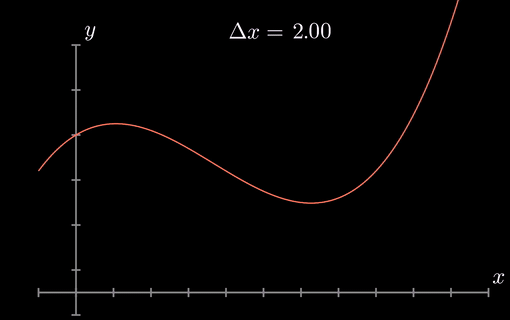

# Adaptive Simpson Integration

An implementation of the Adaptive Simpson Algorithm in C++ for numerical integration with error control. 



## Overview

The Adaptive Simpson algorithm works by recursively subdividing the integration interval until a desired error tolerance is achieved. It uses Simpson's rule to approximate the integral over small subintervals and combines these approximations for the final result.

### Key Features

- Template-based implementation for function flexibility
- Adaptive error control with customizable tolerance
- Built-in function evaluation counter
- Unit testing with utest framework
- Exception handling for invalid inputs
- Performance metrics tracking
- Support for custom integrand functions

## Project Structure

```
.
├── quadrature.h          # Core template header with integration implementation
├── quadrature.cpp        # Main program and example usage
├── unitTests.cpp         # Integration tests
├── compare_adaptive_simpson.m  # MATLAB verification script
├── utest.h              # Unit testing framework header
└── README.md            # This documentation
```

## Implementation Details

### Simpson's Rule

The implementation uses the following formula for Simpson's rule over an interval [α, β]:

```cpp
I(α, β) := (β - α)/6 * (f(α) + 4f((α + β)/2) + f(β))
```

### Error Estimation

Error is estimated by comparing two levels of approximation:
- I1: Single application of Simpson's rule
- I2: Sum of Simpson's rule applied to two subintervals
- Error estimate: |I1 - I2|

## Requirements

- C++ compiler (g++ recommended) with C++11 support
- Standard C++ libraries
- utest.h (included in the repository)
- Make or similar build system

## Building and Running

### Compiling the Main Program

```bash
g++ -o computename compute.cpp
```

### Running the Program

```bash
./computename
```

### Compiling and Running Tests

```bash
g++ -o testname tests.cpp
./testname
```

## Usage Example

The program is designed to compute integrals numerically. Here's a basic example:

```cpp
// Define your function
auto exampleFunction = [](double x) {
    return x + cos(pow(x, 5));
};

// Use the quadrature function
int countFunctionCalls = 0;
double integralValue = quadrature(exampleFunction, &countFunctionCalls, 0, M_PI, 1e-8);
```

### Integration Parameters

- `function`: The integrand function
- `countFunctionCalls`: Pointer to track function evaluations
- `a`: Lower integration bound
- `b`: Upper integration bound
- `tolerance`: Error tolerance (must be > 0)

## Performance Results

The implementation shows the following characteristics based on tolerance levels:

| Tolerance (τ) | Result | Error vs MATLAB | Function Calls |
|--------------|---------|-----------------|----------------|
| 10^-2        | 5.98101 | 0.1749459193    | 1380          |
| 10^-3        | 5.80506 | 0.0010040807    | 4332          |
| 10^-4        | 5.80606 | 0.0000040807    | 8412          |

## Error Handling

The implementation includes robust error handling:
- Throws `underflow_error` for non-positive tolerance values
- Includes maximum recursion depth protection
- Handles floating-point precision considerations in unit tests

## Testing

The unit testing framework includes:
- Integration validation using known integrals
- Error handling verification
- Precision testing with floating-point comparisons
- Verification against MATLAB's integral function

## Limitations

- Maximum recursion depth is fixed
- Performance depends on the smoothness of the integrand
- Floating-point arithmetic limitations apply

## Acknowledgments

- [Reference implementation of Simpson's rule](https://en.wikipedia.org/wiki/Simpson%27s_rule)
- utest framework developers

## References

1. [Inline Functions (C++) — Microsoft Learn](https://learn.microsoft.com/en-us/cpp/cpp/inline-functions-cpp?view=msvc-170)
2. [std::function - cppreference.com](https://en.cppreference.com/w/cpp/utility/functional/function)