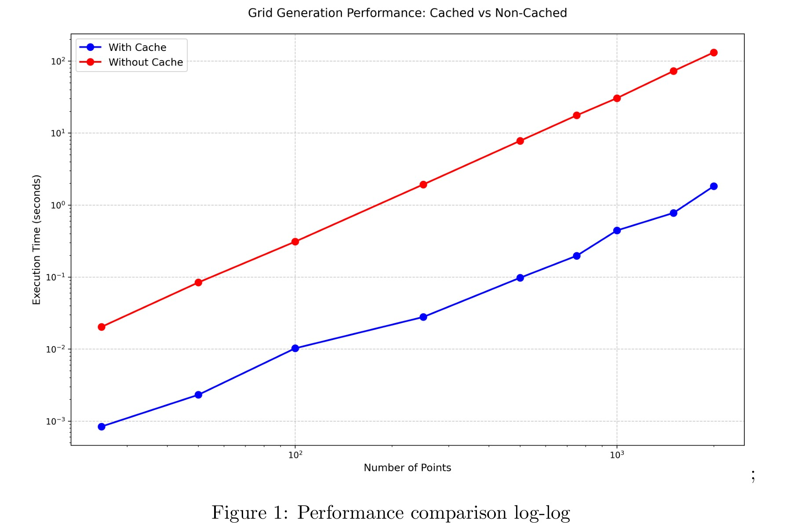
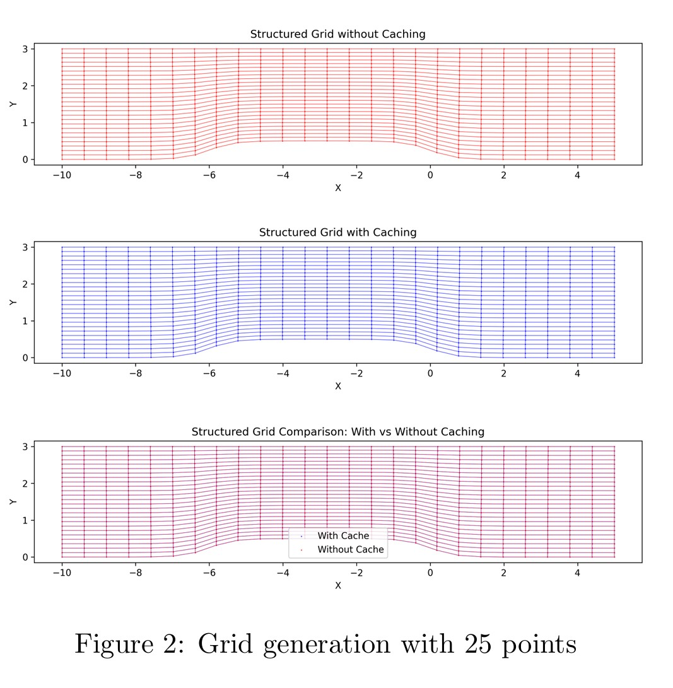
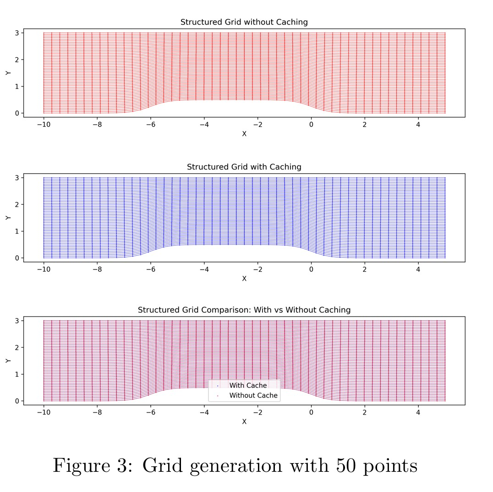
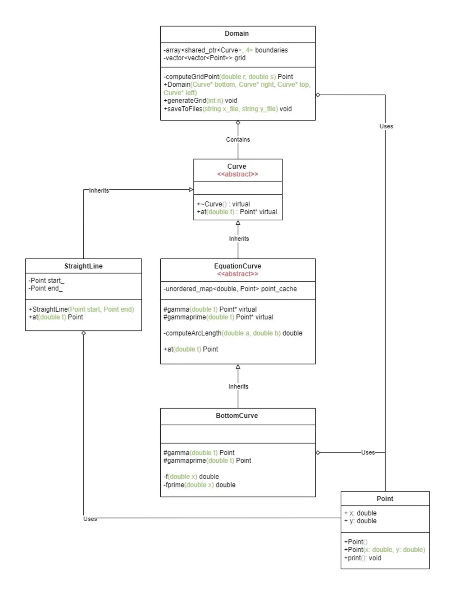

# Curve-Based Grid Generation System

## Overview

This project implements a structured grid generation system using arc-length parameterized curves and transfinite interpolation. The implementation features a sophisticated caching mechanism that significantly improves performance and a robust object-oriented design with abstract types and class hierarchies.

## Performance Analysis



Grid generation timing comparison (in seconds):

| Points | With Cache | Without Cache | Speedup |
|--------|------------|---------------|---------|
| 25     | 0.000840   | 0.020337      | 24x     |
| 50     | 0.002317   | 0.084158      | 36x     |
| 100    | 0.010247   | 0.310217      | 30x     |
| 250    | 0.027846   | 1.928660      | 69x     |
| 500    | 0.097653   | 7.780950      | 80x     |
| 750    | 0.197364   | 17.58410      | 89x     |
| 1000   | 0.443066   | 30.47970      | 69x     |
| 1500   | 0.777103   | 72.55190      | 93x     |
| 2000   | 1.823940   | 131.4420      | 72x     |

Key observations:
- Caching provides significant speedup, from 24x for small grids to over 90x for larger ones
- Performance improvement increases with grid size
- Near-linear scaling with caching vs quadratic scaling without




### Key Features

- Arc-length parameterization using Newton-Raphson method
- Transfinite interpolation for grid generation
- Performance optimization through point caching
- Abstract curve interface with specialized implementations
- Boost library integration for numerical integration (Gauss-Kronrod quadrature)
- Automatic grid generation and visualization

## UML



## Project Structure

```
.
├── Results/                          # Visualization results
│   ├── Figure_1_Performance_comparison_log_log.jpg
│   ├── Figure_2_Grid_generation_with_25_points.jpg
│   └── Figure_3_Grid_generation_with_50_points.jpg
├── UML/                             # Design documentation
│   └── A3_Diagram.jpg               # Class hierarchy diagram
├── Source/                          # Core implementation
│   ├── BottomCurve.cpp             # Sigmoid curve implementation
│   ├── BottomCurve.hpp
│   ├── Curve.hpp                   # Abstract base interface
│   ├── Domain.cpp                  # Grid generation implementation
│   ├── Domain.hpp
│   ├── EquationCurve.cpp          # Arc-length parameterization
│   ├── EquationCurve.hpp
│   ├── Point.hpp                  # 2D point structure
│   └── StraightLine.hpp           # Linear curve implementation
├── main.cpp                        # Main program
└── Output/                         # Generated grid files
├── test                       # Executable
├── x_grid_cache.txt          # Grid x-coordinates with caching
├── x_grid_no_cache.txt       # Grid x-coordinates without caching
├── y_grid_cache.txt          # Grid y-coordinates with caching
└── y_grid_no_cache.txt       # Grid y-coordinates without caching
```

## Implementation Details 

### Class Hierarchy

```
Curve (Abstract)
├── EquationCurve (Abstract)
│   └── BottomCurve
└── StraightLine
```

### Core Components

1. **Curve Interface**
   - Pure virtual destructor
   - Pure virtual `at(double t)` function returns point at parameter t ∈ [0,1]
   - Base class for all curve implementations

2. **EquationCurve**
   - Arc-length parameterization using Newton-Raphson method
   - Gauss-Kronrod quadrature for arc-length computation
   - Optional point caching for performance
   - Virtual `gamma` and `gammaprime` functions for concrete curves

3. **Domain**
   - Stores four boundary curves using smart pointers
   - Implements transfinite interpolation for interior points
   - Generates structured grid with specified resolution
   - File I/O for grid visualization

## Building and Running

### Requirements

- C++11 compliant compiler  
- Boost library (for numerical integration)
- Python 3.x with matplotlib (for visualization)
- Linux environment (tested on Ubuntu)

### Compilation

```bash
# Build main program
g++ -o test main.cpp EquationCurve.cpp Domain.cpp BottomCurve.cpp
```

### Execution

```bash
# Generate grid data
./test

# Generate visualizations
python3 plot_grids_comparison.py
```

### Output Files

The program generates several output files:

1. Grid Data
   - `x_grid_cache.txt`, `y_grid_cache.txt`: Grid coordinates with caching
   - `x_grid_no_cache.txt`, `y_grid_no_cache.txt`: Grid coordinates without caching

## Usage Example

```cpp
// Define corner points
Point p0(-10.0, 0.0);  // Bottom-left
Point p1(5.0, 0.0);    // Bottom-right
Point p2(5.0, 3.0);    // Top-right
Point p3(-10.0, 3.0);  // Top-left

// Create boundary curves (enable caching)
auto bottomCurve = std::make_shared<BottomCurve>(true);  
auto rightCurve = std::make_shared<StraightLine>(p1, p2);
auto topCurve = std::make_shared<StraightLine>(p2, p3);
auto leftCurve = std::make_shared<StraightLine>(p0, p3);

// Create domain and generate grid
Domain domain(bottomCurve, rightCurve, topCurve, leftCurve);
domain.generateGrid(25);  // Generate 25x25 grid
domain.saveToFiles("x_grid.txt", "y_grid.txt");
```

## Error Handling

The implementation includes:
- Parameter validation (t ∈ [0,1])
- Newton-Raphson iteration limits and convergence checks 
- File I/O error handling
- Memory management through smart pointers
- Domain boundary validation

## Future Improvements

1. Grid Quality Enhancement
   - Adaptive grid refinement
   - Grid smoothing algorithms
   - Quality metrics calculation

2. Performance Optimization
   - Parallel grid generation
   - Improved caching strategies
   - SIMD optimization

3. Feature Additions
   - Additional curve types
   - Grid export formats
   - Interactive visualization

## References

[1] M Farrashkhalvat and JP Miles. Basic Structured Grid Generation: With an introduction to unstructured grid generation. Elsevier, 2003.