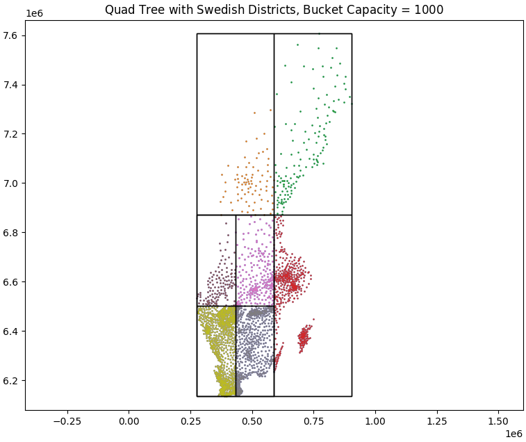
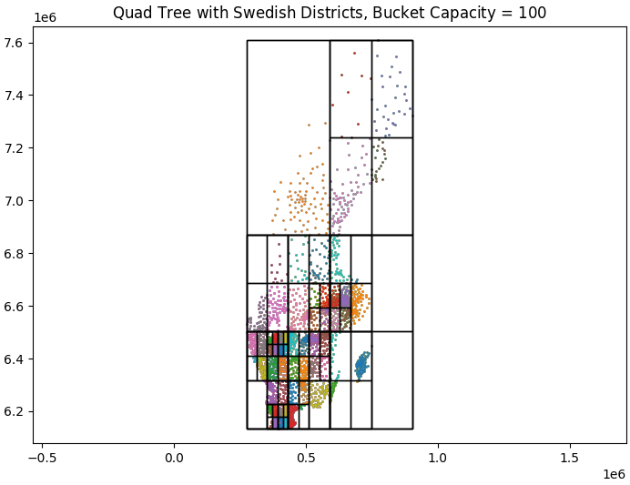
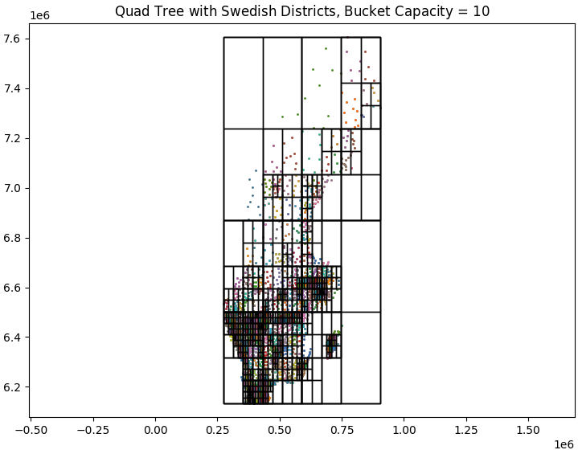

# Spatial Search with Quadtrees

An implementation of a spatial search algorithm using Quadtrees in C++ with resource ownership management and performance optimization.




## Overview

The Quadtree implementation provides efficient spatial querying by recursively subdividing 2D space into quadrants. This partitioning strategy enables fast spatial searches, particularly useful for geographic data like the Swedish districts and lakes dataset.

### Key Features

- Template-based geometry classes for flexibility
- Adaptive quadrant subdivision with customizable bucket capacity
- Built-in performance timing
- Resource ownership management
- Exception handling for invalid inputs
- Performance comparison with brute force approach
- Support for custom point datasets

## Project Structure

```
.
├── results/                    # Visualization results
│   ├── Districts_QuadTree_BC10.png
│   ├── Districts_QuadTree_BC100.png
│   └── Districts_QuadTree_BC1000.png
├── testData/                  # Input datasets
│   ├── swe.csv               # Swedish districts data
│   └── swelakes.csv          # Swedish lakes data
├── utilities/                 # Helper utilities
│   ├── mpl_writer.hpp        # Visualization writer
│   ├── point_reader.hpp      # Data reader
│   ├── random_points.hpp     # Random point generator
│   └── timer.hpp             # Performance timer
├── Geometry.hpp              # Geometric primitives
├── main.cpp                  # Main program
├── Quadtree.hpp             # Core Quadtree implementation
└── README.md                # Documentation
```

## Implementation Details

### Quadtree Structure

The implementation uses a recursive structure where each node contains:
```cpp
struct QuadTree {
    int bucketCapacity;
    vector<Point> innerPoints;
    Rectangle root;
    vector<QuadTree> children;
    bool leaf;
};
```

### Resource Management

Resource ownership is carefully managed:
- Points: Shared ownership among nodes
- Nodes: Exclusive ownership by parent nodes
- Memory: RAII principles for automatic cleanup

## Requirements

- C++ compiler with C++11 support
- Standard C++ libraries
- Linux environment (tested on Ubuntu)
- Utilities package (included in repository)

## Building and Running

### Compiling the Program

```bash
g++ -o executableName main.cpp
```

### Running the Program

```bash
./executableName
```

## Usage Example

Here's a basic example of using the Quadtree:

```cpp
// Create points and root rectangle
vector<Point> points = loadPoints();
Rectangle rootNode = FindMinimalCoveringRectangle(points);

// Initialize Quadtree
int bucketCapacity = 100;
QuadTree qt(points, bucketCapacity, rootNode);

// Perform a spatial query
Rectangle queryRegion(Point(0,0), Point(1,1));
vector<Point> results = qt.query(queryRegion, points);
```

### Parameters

- `points`: Vector of Point objects
- `bucketCapacity`: Maximum points per leaf node
- `rootNode`: Bounding rectangle for entire dataset
- `queryRegion`: Rectangle defining search area

## Performance Results

### Random Point Data Performance Results

| # Points | Bucket Capacity | ET Build Quadtree | % points small region | ET query() | ET Brute Force |
|----------|----------------|-------------------|---------------------|------------|----------------|
| 1,000    | 10             | 11.39 ms          | 2.7%                | 26.55 μs   | 377.04 μs      |
| 1,000    | 100            | 6.15 ms           | 1.0%                | 10.47 μs   | 307.64 μs      |
| 100,000  | 10             | 9.78 s            | 0.4%                | 233.32 μs  | 1,863.57 ms    |
| 100,000  | 1,000          | 8.66 s            | 2.8%                | 1,137.6 μs | 2,008.41 ms    |

### Lake Data Performance Results

| Bucket Capacity | Constructing Quadtree | % points small region | Runtime query() | Runtime Brute Force |
|----------------|----------------------|---------------------|----------------|-------------------|
| 100            | 80.94 s              | 1.45%               | 1310.15 μs     | 17.013 s          |
| 10,000         | 92.895 s             | 1.45%               | 7.18741 ms     | 23.5156 s         |
| 100            | 101.925 s            | 0.48%               | 735.052 μs     | 32.572 s          |
| 10,000         | 105.631 s            | 0.48%               | 6.07343 ms     | 33.3618 s         |

### District Data Performance Results

| Bucket Capacity | Constructing Quadtree | % points small region | Runtime query() | Runtime Brute Force |
|----------------|----------------------|---------------------|----------------|-------------------|
| 10             | 62.296 ms            | 2.4%                | 63.18 μs       | 984.724 μs        |
| 1000           | 35.9585 ms           | 2.4%                | 541.655 μs     | 1486.82 μs        |
| 10             | 61.2787 ms           | 0.31%               | 12.083 μs      | 917.769 μs        |
| 1000           | 17.9674 ms           | 0.31%               | 32.312 μs      | 1226.07 μs        |

*Notes:*
- ET: Execution Time
- μs: microseconds
- ms: milliseconds
- s: seconds

All tests were performed on a laptop equipped with an Intel i7 8-core processor running Ubuntu.

## Error Handling

The implementation includes:
- Validation of bucket capacity
- Bounds checking for queries
- Memory management safeguards
- Geometric validation

## Testing and Visualization

The implementation includes:
- Performance benchmarking
- Visualization of tree structure
- Comparison with brute force method
- Testing with both synthetic and real datasets

## Limitations

- Memory usage increases with decreasing bucket capacity
- Performance depends on point distribution
- Fixed splitting strategy (quadrants)
- All points stored in internal nodes

## Future Improvements

1. Node Specialization
   - Separate MiddleNode and LeafNode classes
   - Improved memory efficiency
   - Better type safety

2. Memory Optimization
   - Points only in leaf nodes
   - Smart pointer implementation
   - Custom allocator support

## References

1. [Resource Management in C++](https://en.cppreference.com/w/cpp/language/raii)
2. [Quadtree Data Structure](https://en.wikipedia.org/wiki/Quadtree)